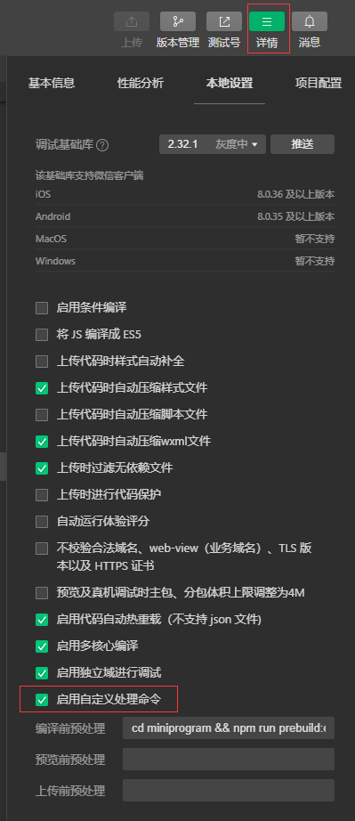
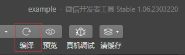

# miniprogram-dayjs-copy

> 演示如何使用编译前预处理按需引入`dayjs`的插件，请确保使用本工具前已安装 dayjs，并已执行构建 NPM。
> 引入插件的方式有很多种，不一定非要使用哪一种，可以的话，请考虑直接下载插件对应js文件到项目中直接引入也是可以的。

## 开始

```
npm install -D miniprogram-dayjs-copy
```

在`package.json`中添加配置:

```json
{
  "scripts": {
    "prebuild": "cdp"
  }
}
```

### 增加插件配置

本工具在`package.json`中支持如下配置：

```json5
{
  config: {
    "miniprogram-dayjs-copy": {
      miniprogram_npm: "miniprogram_npm路径，例如./miniprogram_npm，可缺省",
      node_modules: "node_modules路径，例如./node_modules，可缺省",
      esm: true, // 是否使用 dayjs/esm 中js，true为使用
      plugins: ["plugin/advancedFormat", "locale/zh", "locale/en"],
    },
  },
}
```

### 使用自定义预处理命令

<p align="left">
  
</p>

在下方的编译前预处理中根据工作路径与`package.json`位置添加如下内容：

```
npm run prebuild
```

### 手动运行编译

<p align="left">
  
</p>

### DEMO

[DEMO](example)见本仓库中`example`文件夹，克隆本项目后，使用微信开发者工具导入`example`。随后执行：

```
cd miniprogram
npm install
```

## 注意事项

请确保本工具是作为`devDependencies`被引入，避免被打包。

## 原理

使用编译前预处理执行 Shell 拷贝相关插件

## 缺陷

- 每次新增插件配置需要手动执行编译，比较繁琐，自动编译不会自动执行编译前预处理。但是一般不会经常修改配置。
- 暂不支持自动移除未引入插件，对于以前引入过之后不再需要的插件需要手动删除。
- 微信开发者工具的清除编译缓存可能不是很奏效，有些时候你需要重启开发者工具，比如一些手动删除导致的引入错误。

## 相关文档

- [自定义预处理](https://developers.weixin.qq.com/miniprogram/dev/devtools/debug.html#%E8%87%AA%E5%AE%9A%E4%B9%89%E9%A2%84%E5%A4%84%E7%90%86)
- [发布其他-npm-包的约束](https://developers.weixin.qq.com/miniprogram/dev/devtools/npm.html#%E5%8F%91%E5%B8%83%E5%85%B6%E4%BB%96-npm-%E5%8C%85%E7%9A%84%E7%BA%A6%E6%9D%9F)
